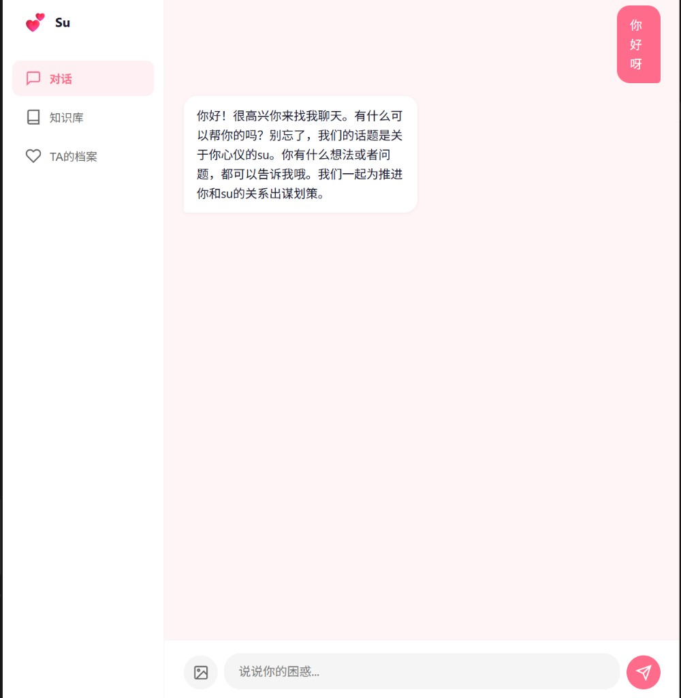
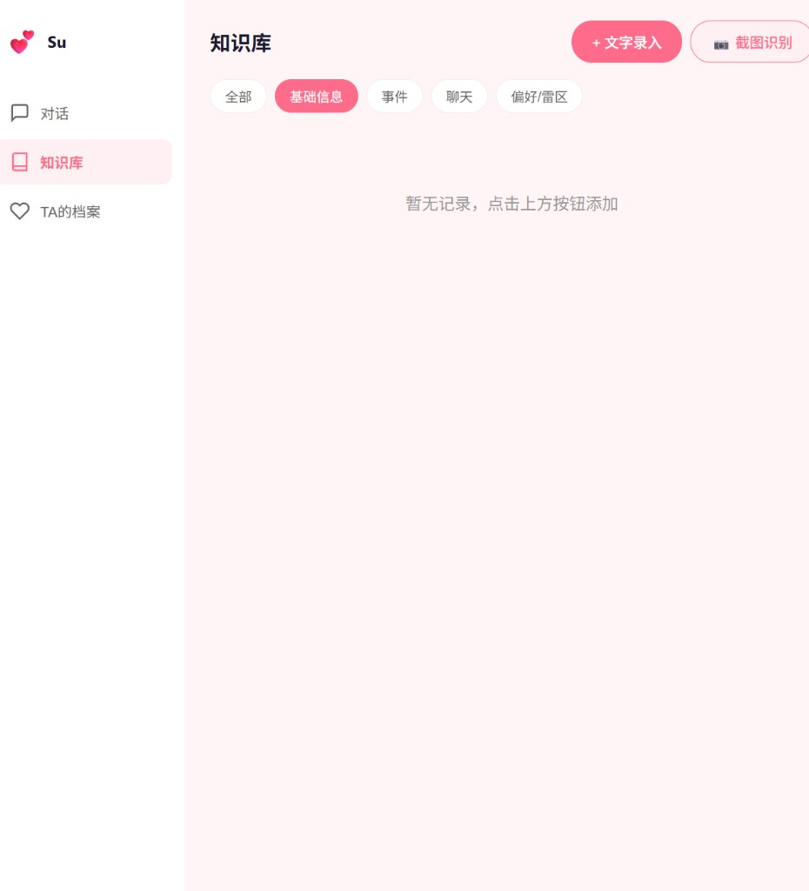
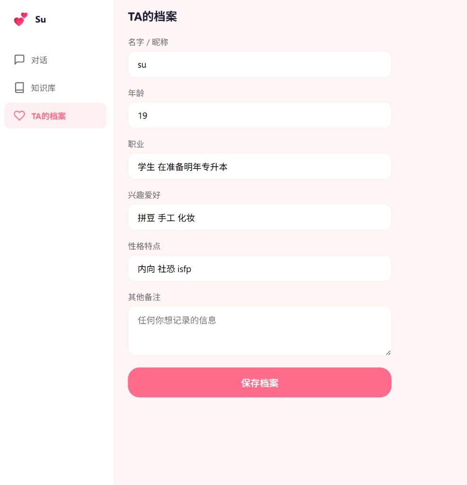

# 💕 Su

**基于个人知识库的 AI 恋爱顾问，帮你推进关系、维护关系。**

录入心仪对象的信息（文字+聊天截图），AI 基于这些先验知识提供个性化的关系建议。全程本地存储，隐私安全。

[](web/)
[-orange.svg)](https://platform.moonshot.cn)

---

| 对话 | 知识库 | TA的档案 |
| :---: | :---: | :---: |
|  |  |  |

---

## ⚡ 30 秒跑起来

```bash
cd web
cp .env.example .env          # 填入你的 Kimi API Key
npm install
npm run dev                   # → http://localhost:3000
```

部署后直接打开链接即可使用，苹果、安卓、电脑通用。

---

## ✨ 核心功能

| 功能 | 说明 |
|------|------|
| 💬 AI对话 | 基于知识库的个性化恋爱建议，流式输出 |
| 📚 知识库 | 录入对象的各种信息，支持分类管理 |
| 📷 截图识别 | 上传聊天截图自动提取关键信息 |
| 👤 档案管理 | 记录对象的基础信息 |
| 🔒 本地存储 | 数据存在浏览器 IndexedDB，不上云 |
| 📱 全平台 | 一个链接，手机电脑都能用 |

---

## 🛠️ 技术栈

| 技术 | 用途 |
|------|------|
| React 18 + TypeScript | 前端框架 |
| Vite 5 | 构建工具 |
| TailwindCSS | 样式 |
| IndexedDB (idb) | 本地存储 |
| Kimi API | AI 大模型 |
| Netlify / Vercel | 部署 + API 代理 |

---

## 📖 项目结构

```
su-app/
├── web/
│   ├── src/
│   │   ├── pages/        # 对话、知识库、档案、设置
│   │   ├── services/     # AI 服务、IndexedDB
│   │   └── components/   # 布局组件
│   ├── .env.example
│   ├── vercel.json       # Vercel 部署配置
│   └── vite.config.ts
├── netlify.toml          # Netlify 部署配置
└── docs/screenshots/
```

---

## 🚀 部署

### Netlify（推荐）

1. Fork 本仓库
2. 在 Netlify 导入项目
3. 会自动读取根目录的 `netlify.toml` 配置
4. 部署完成后得到公开链接

### Vercel

1. Fork 本仓库
2. 在 Vercel 导入项目，设置 Root Directory 为 `web`
3. 部署完成

API Key 由用户在「设置」页面自行填入，存储在浏览器本地。

---

## 📄 License

MIT — 随便用，开心就好。
